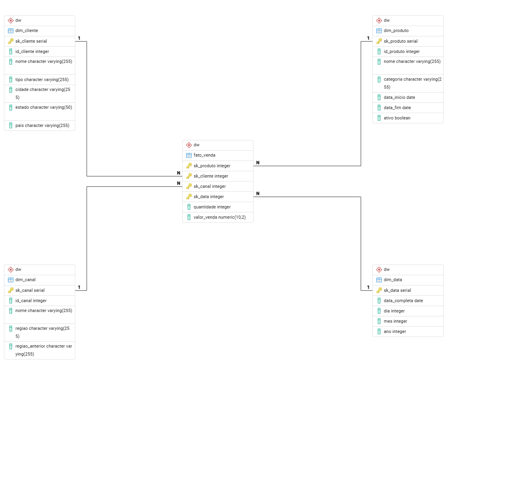

# 🏢 Data Warehouse com Modelagem Dimensional

**Implementação completa de Data Warehouse local com Star Schema, SCD Tipo 2/3, procedures ETL, views materializadas e análises SQL**

---

## 📊 Visão Geral

Data Warehouse dimensional para análise de vendas implementando:

- ⭐ **Star Schema** (1 fato central + 4 dimensões)
- 🔄 **SCD Tipo 2 e 3** (Slowly Changing Dimensions - histórico mudanças)
- ⚙️ **ETL automatizado** via Stored Procedures
- 📊 **Views e Views Materializadas** para analytics
- 🔧 **Functions SQL** parametrizadas para relatórios
- 🐳 **Ambiente Docker** completo PostgreSQL

**Stack:** PostgreSQL 16.1, PL/pgSQL, Docker, SQL

---

## 🎯 Objetivos do Projeto

Este projeto demonstra competências **Analytics Engineering**:

### 1. Modelagem Dimensional
- Design **Star Schema** otimizado para analytics
- Definição clara **fato vs dimensões**
- **Granularidade** apropriada (1 venda = 1 linha)
- **Surrogate keys** (sk_*) para performance

### 2. Slowly Changing Dimensions (SCD)
- **SCD Tipo 2:** Histórico completo de mudanças (dim_produto)
  - Rastreia versões: data_inicio, data_fim, ativo
  - Mantém integridade histórica das análises
- **SCD Tipo 3:** Atributos históricos limitados (dim_canal)
  - Rastreia: regiao atual + regiao_anterior

### 3. Automação ETL
- **Procedures:** sp_popula_dim_data, sp_carrega_tabela_fato
- **Functions:** RelatorioVendasPorCliente (parametrizada)
- **Views:** Agregações pré-definidas
- **Materialized Views:** Performance queries complexas

### 4. Casos de Uso Analytics
- Vendas por produto e canal
- Vendas por cliente e período
- Análises temporais (ano, mês)
- Consolidações categorizadas

---

## 🏗️ Arquitetura - Star Schema

### Modelo Entidade-Relacionamento



### Estrutura Dimensional
```
                    ┌─────────────────────┐
                    │   dim_produto       │
                    │─────────────────────│
                    │ sk_produto (PK)     │
                    │ id_produto          │
                    │ nome                │
                    │ categoria           │
                    │ preco               │
                    │─────────────────────│
                    │ SCD Tipo 2:         │
                    │ • data_inicio       │
                    │ • data_fim          │
                    │ • ativo             │
                    └──────────┬──────────┘
                               │
                               │
        ┌──────────────────────┼──────────────────────┐
        │                      │                      │
┌───────┴────────────┐  ┌──────▼──────────┐  ┌───────┴─────────┐
│   dim_canal        │  │  fato_venda     │  │  dim_cliente    │
│────────────────────│  │─────────────────│  │─────────────────│
│ sk_canal (PK)      │──│ sk_produto (FK) │──│ sk_cliente (PK) │
│ id_canal           │  │ sk_canal (FK)   │  │ id_cliente      │
│ nome               │  │ sk_data (FK)    │  │ nome            │
│ tipo               │  │ sk_cliente (FK) │  │ cidade          │
│────────────────────│  │─────────────────│  │ estado          │
│ SCD Tipo 3:        │  │ quantidade      │  └─────────────────┘
│ • regiao           │  │ valor_venda     │
│ • regiao_anterior  │  └────────┬────────┘
└────────────────────┘           │
                        ┌────────▼────────┐
                        │   dim_data      │
                        │─────────────────│
                        │ sk_data (PK)    │
                        │ dia             │
                        │ mes             │
                        │ ano             │
                        │ data_completa   │
                        └─────────────────┘
```

### Componentes

#### Tabela Fato: `fato_venda`
**Granularidade:** 1 linha = 1 transação de venda

**Métricas (medidas):**
- `quantidade` - Unidades vendidas
- `valor_venda` - Receita da venda (R$)

**Chaves estrangeiras (dimensões):**
- `sk_produto` → dim_produto
- `sk_canal` → dim_canal  
- `sk_data` → dim_data
- `sk_cliente` → dim_cliente

**Constraint:** Unique (sk_produto, sk_canal, sk_data, sk_cliente) - evita duplicatas

#### Dimensões

**1. dim_produto** - O QUE foi vendido
- Produto, categoria, preço
- **SCD Tipo 2:** Histórico completo de mudanças
- Rastreia versões do produto ao longo do tempo

**2. dim_canal** - ONDE foi vendido
- Canal (Loja Física, E-commerce, Marketplace)
- Tipo canal, região
- **SCD Tipo 3:** Região atual + anterior

**3. dim_data** - QUANDO foi vendido
- Dia, mês, ano (2021-2031)
- ~4.000 registros (gerados via procedure)
- Permite análises temporais (YoY, MoM)

**4. dim_cliente** - QUEM comprou
- Cliente, localização (cidade, estado)
- Análises geográficas

---

## 📊 Recursos Implementados

### ⚙️ Stored Procedures (Automação ETL)

**1. sp_popula_dim_data**
- Popula dimensão tempo (2021-2031)
- ~4.000 registros (todas datas do período)
- Execução única (setup inicial)

**2. sp_carrega_tabela_fato**
- Gera 1.000 vendas simuladas
- Randomiza: produto, canal, data, cliente, quantidade, valor
- Exception handling (unique_violation)

**3. update_dim_produto (SCD Tipo 2)**
- Detecta mudanças no produto (nome, categoria)
- Fecha registro atual (data_fim, ativo=false)
- Insere novo registro (versão atualizada)

### 📈 Views (Agregações Pré-definidas)

**1. VW_VendasPorProdutoCanal**
- Total de vendas e quantidade por produto × canal
- Análise: performance produtos por canal

**2. VW_VendasPorClientePeriodo**
- Total de vendas por cliente × ano × mês
- Análise: comportamento do cliente temporal

### 🚀 Materialized Views (Performance)

**MV_RelatorioVendasResumido**
- Vendas consolidadas: categoria × ano
- Pré-calculada (performance!)
- Refresh manual: `REFRESH MATERIALIZED VIEW`

### 🔧 Functions (Relatórios Parametrizados)

**RelatorioVendasPorCliente(cliente_nome, relatorio_ano)**
- Parâmetros opcionais (NULL = todos)
- Retorna: categoria, produto, ano, mês, vendas, quantidade
- Exemplos uso:
  - Todos clientes/anos: `SELECT * FROM dw.RelatorioVendasPorCliente()`
  - Cliente específico: `SELECT * FROM dw.RelatorioVendasPorCliente('João Silva')`
  - Ano específico: `SELECT * FROM dw.RelatorioVendasPorCliente(NULL, 2024)`
  - Ambos: `SELECT * FROM dw.RelatorioVendasPorCliente('João Silva', 2024)`

---

## 💡 Exemplos Análises SQL

### 1. Vendas Totais por Produto
```sql
SELECT 
    p.nome AS produto,
    p.categoria,
    SUM(f.quantidade) AS total_unidades,
    SUM(f.valor_venda) AS receita_total,
    ROUND(AVG(f.valor_venda), 2) AS ticket_medio
FROM dw.fato_venda f
JOIN dw.dim_produto p ON f.sk_produto = p.sk_produto
WHERE p.ativo = true  -- Apenas versão atual (SCD2)
GROUP BY p.nome, p.categoria
ORDER BY receita_total DESC;
```

### 2. Performance por Canal de Venda
```sql
SELECT * FROM dw.VW_VendasPorProdutoCanal
ORDER BY total_vendas DESC;
```

### 3. Vendas Mês a Mês (Time Series)
```sql
SELECT 
    d.ano,
    d.mes,
    COUNT(*) AS total_transacoes,
    SUM(f.quantidade) AS unidades_vendidas,
    SUM(f.valor_venda) AS receita
FROM dw.fato_venda f
JOIN dw.dim_data d ON f.sk_data = d.sk_data
GROUP BY d.ano, d.mes
ORDER BY d.ano, d.mes;
```

### 4. Top 10 Clientes por Receita
```sql
SELECT 
    c.nome AS cliente,
    c.cidade,
    c.estado,
    COUNT(*) AS total_compras,
    SUM(f.valor_venda) AS receita_total
FROM dw.fato_venda f
JOIN dw.dim_cliente c ON f.sk_cliente = c.sk_cliente
GROUP BY c.nome, c.cidade, c.estado
ORDER BY receita_total DESC
LIMIT 10;
```

### 5. Histórico Mudanças Produto (SCD Tipo 2)
```sql
SELECT
    p.id_produto,
    p.nome,
    p.categoria,
    p.data_inicio,
    p.data_fim,
    p.ativo,
    ROW_NUMBER() OVER (PARTITION BY p.id_produto ORDER BY p.data_inicio) AS versao
FROM dw.dim_produto AS p
ORDER BY p.id_produto, versao;
```


### 6. Mudanças Canal (SCD Tipo 3)
```sql
SELECT 
    id_canal,
    nome,
    regiao AS regiao_atual,
    regiao_anterior
FROM dw.dim_canal
WHERE regiao_anterior IS NOT NULL;
```


---

## 💡 Casos de Uso

**Este DW responde perguntas como:**

**Produto:**
- Quais produtos vendem mais?
- Qual categoria maior receita?
- Como produto mudou ao longo do tempo? (SCD2)

**Canal:**
- E-commerce vs Loja Física - performance?
- Canal mudou região de operação? (SCD3)

**Tempo:**
- Vendas crescem mês a mês?
- Sazonalidade?
- Tendência anual?

**Cliente:**
- Top 10 clientes receita?
- Distribuição geográfica de vendas?
- Clientes recorrentes?

**Multidimensional:**
- Produto X vendeu mais em qual canal?
- Cliente Y compra mais em qual categoria?

---

## 🚀 Setup e Execução

### Pré-requisitos

- Docker Desktop instalado e rodando
- ~2GB espaço livre em disco
- Cliente SQL: [PgAdmin](https://www.pgadmin.org/download/)

### 1️⃣ Criar Container PostgreSQL
```bash
docker run --name datawarehouse -p 5431:5432 -e POSTGRES_DB=dbdw -e POSTGRES_USER=admin -e POSTGRES_PASSWORD=dw1122 -d postgres:16.1
```

**Verificar:**
```bash
docker ps
```

Saída esperada:
```
NAME             STATUS         PORTS
datawarehouse    Up (healthy)   0.0.0.0:5431->5432/tcp
```

### 2️⃣ Conectar PgAdmin

**Configuração:**
- Host: `localhost`
- Port: `5431`
- Database: `dbdw`
- Username: `admin`
- Password: `dw1122`

### 3️⃣ Criar Modelo Físico

**Executar no PgAdmin Query Tool:**

📁 **Script:** [Scripts-SQL/Modelo-Fisico.sql](Scripts-SQL/Modelo-Fisico.sql)

**Resultado:**
- Schema `dw` criado
- 4 tabelas dimensão criadas
- 1 tabela fato criada
- Constraints e índices aplicados

### 4️⃣ Carga Inicial de Dados

**Executar no PgAdmin:**

📁 **Script:** [Scripts-SQL/Carga-Dados.sql](Scripts-SQL/Carga-Dados.sql)

**Dados carregados:**
- dim_produto: 10 produtos
- dim_canal: 3 canais
- dim_cliente: 20 clientes
- dim_data: VAZIO (próximo passo!)

### 5️⃣ Popular Dimensão Tempo

**Criar + Executar Procedure:**
```sql
CREATE OR REPLACE PROCEDURE dw.sp_popula_dim_data()
LANGUAGE plpgsql
AS $$
DECLARE
    v_data_inicial DATE := '2021-01-01';
    v_data_final DATE := '2031-12-31';
BEGIN
    WHILE v_data_inicial <= v_data_final LOOP
        INSERT INTO dw.dim_data (dia, mes, ano, data_completa)
        VALUES (
            EXTRACT(DAY FROM v_data_inicial),
            EXTRACT(MONTH FROM v_data_inicial),
            EXTRACT(YEAR FROM v_data_inicial),
            v_data_inicial
        );
        v_data_inicial := v_data_inicial + INTERVAL '1 day';
    END LOOP;
END;
$$;

CALL dw.sp_popula_dim_data();
```

**Resultado:** ~4.000 datas inseridas (2021-2031)

### 6️⃣ Gerar Dados Fato (Vendas)

**Criar + Executar Procedure:**
```sql
CREATE OR REPLACE PROCEDURE dw.sp_carrega_tabela_fato()
LANGUAGE plpgsql
AS $$
DECLARE
    i INT := 1;
    v_sk_produto INT;
    v_sk_canal INT;
    v_sk_data INT;
    v_sk_cliente INT;
BEGIN
    WHILE i <= 1000 LOOP
        v_sk_produto := (SELECT sk_produto FROM dw.dim_produto ORDER BY RANDOM() LIMIT 1);
        v_sk_canal := (SELECT sk_canal FROM dw.dim_canal ORDER BY RANDOM() LIMIT 1);
        v_sk_data := (SELECT sk_data FROM dw.dim_data WHERE ano <= 2025 ORDER BY RANDOM() LIMIT 1);
        v_sk_cliente := (SELECT sk_cliente FROM dw.dim_cliente ORDER BY RANDOM() LIMIT 1);

        BEGIN
            INSERT INTO dw.fato_venda (sk_produto, sk_canal, sk_data, sk_cliente, quantidade, valor_venda)
            VALUES (
                v_sk_produto,
                v_sk_canal,
                v_sk_data,
                v_sk_cliente,
                FLOOR(1 + RANDOM() * 125),
                ROUND(CAST(RANDOM() * 1000 AS numeric), 2)
            );
            i := i + 1;
        EXCEPTION WHEN unique_violation THEN
            CONTINUE;
        END;
    END LOOP;
END;
$$;

CALL dw.sp_carrega_tabela_fato();
```

**Resultado:** 1.000 vendas simuladas

### 7️⃣ Criar Views

**VW_VendasPorProdutoCanal:**
```sql
CREATE VIEW dw.VW_VendasPorProdutoCanal AS
SELECT 
    dp.nome AS Nome_Produto,
    dc.nome AS Nome_Canal,
    SUM(fv.valor_venda) AS Total_Vendas,
    SUM(fv.quantidade) AS Total_Quantidade
FROM dw.fato_venda fv
JOIN dw.dim_produto dp ON fv.sk_produto = dp.sk_produto
JOIN dw.dim_canal dc ON fv.sk_canal = dc.sk_canal
GROUP BY dp.nome, dc.nome;
```

**VW_VendasPorClientePeriodo:**
```sql
CREATE VIEW dw.VW_VendasPorClientePeriodo AS
SELECT 
    dc.nome AS Nome_Cliente,
    dd.ano,
    dd.mes,
    SUM(fv.valor_venda) AS Total_Vendas,
    SUM(fv.quantidade) AS Total_Quantidade
FROM dw.fato_venda fv
JOIN dw.dim_cliente dc ON fv.sk_cliente = dc.sk_cliente
JOIN dw.dim_data dd ON fv.sk_data = dd.sk_data
GROUP BY dc.nome, dd.ano, dd.mes;
```

### 8️⃣ Criar Materialized View
```sql
CREATE MATERIALIZED VIEW dw.MV_RelatorioVendasResumido AS
SELECT 
    dp.categoria AS Categoria,
    SUM(fv.valor_venda) AS Total_Vendas,
    SUM(fv.quantidade) AS Total_Quantidade,
    dd.Ano
FROM dw.fato_venda fv
JOIN dw.dim_produto dp ON fv.sk_produto = dp.sk_produto
JOIN dw.dim_data dd ON fv.sk_data = dd.sk_data
GROUP BY dp.categoria, dd.ano
ORDER BY dd.ano;
```

**Atualizar:**
```sql
REFRESH MATERIALIZED VIEW dw.MV_RelatorioVendasResumido;
```

### 9️⃣ Criar Function Relatórios
```sql
CREATE OR REPLACE FUNCTION dw.RelatorioVendasPorCliente(
    cliente_nome VARCHAR DEFAULT NULL, 
    relatorio_ano INT DEFAULT NULL
)
RETURNS TABLE (
    categoria VARCHAR,
    nome_produto VARCHAR,
    ano INT,
    mes INT,
    total_valor_Venda DECIMAL(10, 2),
    total_quantidade INT
)
LANGUAGE plpgsql
AS $$
BEGIN
    RETURN QUERY
    SELECT 
        dp.categoria,
        dp.nome AS nome_produto,
        dd.ano,
        dd.mes,
        SUM(fv.valor_venda) AS total_valor_Venda,
        CAST(SUM(fv.quantidade) AS INTEGER) AS total_quantidade
    FROM dw.fato_venda fv
    JOIN dw.dim_produto dp ON fv.sk_produto = dp.sk_produto
    JOIN dw.dim_data dd ON fv.sk_data = dd.sk_data
    JOIN dw.dim_cliente dc ON fv.sk_cliente = dc.sk_cliente
    WHERE 
        (cliente_nome IS NULL OR dc.nome = cliente_nome) AND
        (relatorio_ano IS NULL OR dd.ano = relatorio_ano)
    GROUP BY dp.categoria, dp.nome, dd.ano, dd.mes
    ORDER BY dp.categoria, dp.nome, dd.ano, dd.mes;
END;
$$;
```

### 🔟 Implementar SCD Tipo 2

**Criar Function:**
```sql
CREATE OR REPLACE FUNCTION dw.update_dim_produto(
    v_id_produto INT, 
    v_nome VARCHAR, 
    v_categoria VARCHAR, 
    v_data_atual DATE
)
RETURNS VOID AS $$
BEGIN
    IF EXISTS (
        SELECT 1 FROM dw.dim_produto 
        WHERE id_produto = v_id_produto AND ativo
        AND (nome <> v_nome OR categoria <> v_categoria)
    ) THEN
        UPDATE dw.dim_produto 
        SET data_fim = v_data_atual, ativo = false
        WHERE id_produto = v_id_produto AND ativo;

        INSERT INTO dw.dim_produto (id_produto, nome, categoria, data_inicio, data_fim, ativo)
        VALUES (v_id_produto, v_nome, v_categoria, v_data_atual, NULL, true);
    END IF;
END;
$$ LANGUAGE plpgsql;
```

**Testar SCD Tipo 2:**
```sql
SELECT dw.update_dim_produto(10000, 'Mouse', 'Periféricos', CURRENT_DATE);

SELECT
    p.*,
    ROW_NUMBER() OVER (PARTITION BY p.id_produto ORDER BY p.data_inicio) AS versao
FROM dw.dim_produto AS p
ORDER BY p.id_produto, versao;
```

### 1️⃣1️⃣ Implementar SCD Tipo 3

**Testar SCD Tipo 3:**
```sql
UPDATE dw.dim_canal
SET regiao_anterior = 'América Latina'
WHERE id_canal = 109;

UPDATE dw.dim_canal
SET regiao = 'LATAM'
WHERE id_canal = 109;

SELECT * FROM dw.dim_canal;
```

---

## 🔧 Técnicas Implementadas

### Modelagem Dimensional
- ✅ Star Schema (fato + dimensões)
- ✅ Surrogate Keys (sk_*)
- ✅ Granularidade apropriada
- ✅ Desnormalização performance

### Slowly Changing Dimensions
- ✅ **SCD Tipo 2:** Histórico completo (dim_produto)
- ✅ **SCD Tipo 3:** Atributos anteriores (dim_canal)
- ✅ Integridade temporal análises

### Automação ETL
- ✅ Stored Procedures (PL/pgSQL)
- ✅ Exception handling
- ✅ Randomização realista

### Performance Analytics
- ✅ Views (agregações pré-definidas)
- ✅ Materialized Views (pré-calculadas)
- ✅ Índices chaves (PK, FK)
- ✅ Functions parametrizadas

---

## 📁 Estrutura do Projeto
```
Data-Warehouse/
├── Scripts-SQL/
│   ├── Modelo-Fisico.sql       # DDL Star Schema
│   └── Carga-Dados.sql         # INSERT dimensões
├── Documentacao/
│   ├── Modelo-Entidade-Relacionamento.jpg
│   ├── Resultado SCD Tipo 2.png
│   └── Resultado SCD Tipo 3.png
└── README.md                    # Este arquivo
```

---

## 🛠️ Comandos Úteis

### Docker
```bash
# Iniciar container parado
docker start datawarehouse

# Parar container
docker stop datawarehouse

# Ver logs
docker logs datawarehouse

# Remover container (CUIDADO - perde dados!)
docker rm -f datawarehouse
```

### PostgreSQL
```bash
# Acessar psql
docker exec -it datawarehouse psql -U admin -d dbdw

# Backup
docker exec datawarehouse pg_dump -U admin dbdw > backup.sql

# Restore
cat backup.sql | docker exec -i datawarehouse psql -U admin -d dbdw
```

---

## 📚 Conceitos Demonstrados

**Analytics Engineering:**
- Modelagem dimensional (Star Schema)
- SCD Tipo 2 e 3
- Granularidade fato
- Surrogate keys
- ETL via SQL
- Views materializadas
- Functions parametrizadas

**Data Warehousing:**
- OLTP vs OLAP
- Desnormalização performance
- Dimensões vs Fatos
- Índices otimização
- Histórico temporal (SCD)

**SQL Avançado:**
- Stored Procedures (PL/pgSQL)
- Exception handling
- Window functions (ROW_NUMBER)
- Agregações (SUM, AVG, COUNT)

---

## 📄 Licença

MIT License - veja [LICENSE](../LICENSE) para detalhes

---

## 📧 Contato

Dúvidas ou sugestões sobre este projeto?

📧 jeysel@gmail.com  
🐙 [GitHub](https://github.com/jeysel/Engenharia-Dados)

---

**Última atualização:** Março 2026